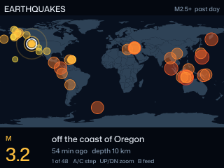

# badgeware

Apps for the [Pimoroni Badgeware Tufty 2350](https://shop.pimoroni.com/products/tufty-2350)
badge. Two pull live data over WiFi; the third is a name badge built around your own logo.
All draw on the badge's full 320x240 screen.

Also here: a drop-in `secrets.py` that takes a **list** of WiFi networks instead of a
single one, so the badge connects on whichever is in range — see
[More than one WiFi network](#more-than-one-wifi-network).

Written and tested on Tufty firmware v3.1.1.

## Apps

### Planes Overhead

A radar scope of the aircraft flying near you right now: a rotating sweep, range
rings, and a marker for each aircraft pointing along its heading. A side panel
shows the selected aircraft's callsign, type, altitude, speed, distance, bearing
and heading.

| Button | Action |
|---|---|
| A / C | Step through aircraft, nearest first |
| UP / DOWN | Change range (10, 25, 50, 100 nm) |
| B | Toggle callsign labels |

- Aircraft positions come from [adsb.lol](https://adsb.lol) every 20 seconds.
  Between fetches each marker keeps moving along its last reported track.
- The badge works out roughly where it is from its internet address, using
  [ip-api.com](https://ip-api.com). To pin an exact position instead, add
  `LATITUDE` and `LONGITUDE` to `secrets.py` on the badge.
- adsb.lol asks every client to identify itself with a contact detail. **Change
  the `HEADERS` line near the top of `planes_overhead/__init__.py` to your own
  contact before you use it.**

### Earthquakes

Recent earthquakes from the [USGS](https://earthquake.usgs.gov/earthquakes/feed/)
plotted on a world map, sized and coloured by magnitude. The bar underneath shows
the selected quake's magnitude, place, age and depth.

| Button | Action |
|---|---|
| A / C | Step through quakes, newest first |
| UP / DOWN | Zoom in on the selected quake |
| B | Switch feed (M2.5+ past day, M4.5+ past week, significant past month) |

- The feed refreshes every five minutes.
- The map is the `world.geo.json` that ships with the stock firmware.

### Logo Badge

A three-page name badge built around your own logo or picture: the art with a
name plate, a page of your social accounts, and a QR code.

| Button | Action |
|---|---|
| A | Previous page |
| C or B | Next page |

To make it yours:

- Edit the name, role, accounts and QR address at the top of
  `logo_badge/__init__.py`. The accounts can be any of the services with an icon
  in `logo_badge/assets/socials`.
- Replace the placeholder art by running `python logo_badge/make_assets.py
  your-picture.png` on your computer (needs Pillow). It fits the picture above
  the name plate and builds the dimmed copy used behind the other pages.
- The QR code is generated on the badge, which needs firmware v3.1.0 or newer.

The social icons come from Pimoroni's stock badge app and are MIT licensed; see
`logo_badge/assets/socials/LICENSE`.

## More than one WiFi network

The stock firmware reads a single `WIFI_SSID` and `WIFI_PASSWORD` from
`secrets.py`. `extras/multi_wifi_secrets.py` is a drop-in replacement that takes
a list of networks instead: whenever an app loads it, the badge scans for what is
in range and uses the first listed network it can see. Every app, stock or from
this repo, then connects without any changes.

1. Fill in your networks, region and timezone in `extras/multi_wifi_secrets.py`.
2. Put the badge into disk mode and copy the file to the root of the drive as
   `secrets.py`, replacing the one that is there.
3. Eject, then press RESET.

- The scan adds a little over a second to starting any app that reads `secrets.py`.
- If none of the listed networks is in range, the badge tries the first one in the list.
- Reflashing the badge with a "with-filesystem" firmware image resets `secrets.py`.

Keep your filled-in copy out of any public repository; it holds your WiFi passwords.

## Installing

1. Set your WiFi details in `secrets.py` on the badge, if you haven't already — or use
   the multi-network replacement from [More than one WiFi network](#more-than-one-wifi-network).
2. Put the badge into disk mode (double-press RESET).
3. Copy the app's folder (`planes_overhead`, `earthquakes` or `logo_badge`) into `apps` on the badge.
4. Eject the drive and wait for it to finish, then press RESET.

Always eject before resetting or unplugging. The badge's drive is easily
corrupted if it disappears while the computer is still writing to it.

## Icons

`make_app_icons.py` draws the 24x24 launcher icons from character grids, so they
can be edited pixel by pixel. It needs Pillow (`pip install pillow`).

## Data sources

Check each provider's terms before building on these apps.

- [adsb.lol](https://adsb.lol) for aircraft positions
- [ip-api.com](https://ip-api.com) for approximate location (free for non-commercial use)
- [USGS Earthquake Hazards Program](https://earthquake.usgs.gov/earthquakes/feed/) for earthquakes

## License

GPL-3.0. See [LICENSE](LICENSE).
